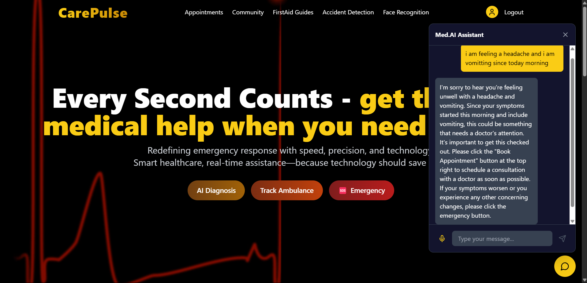
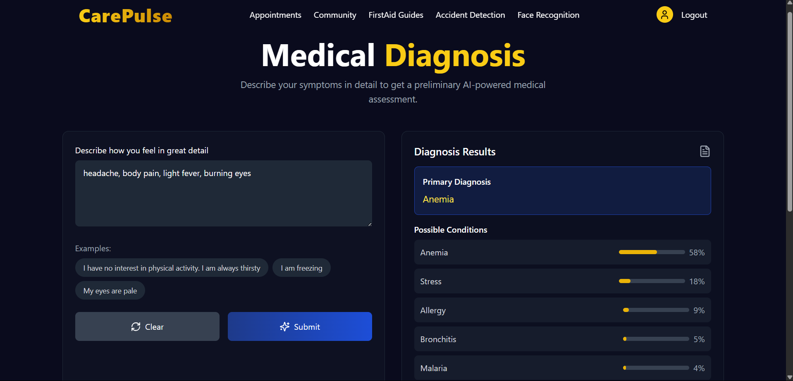
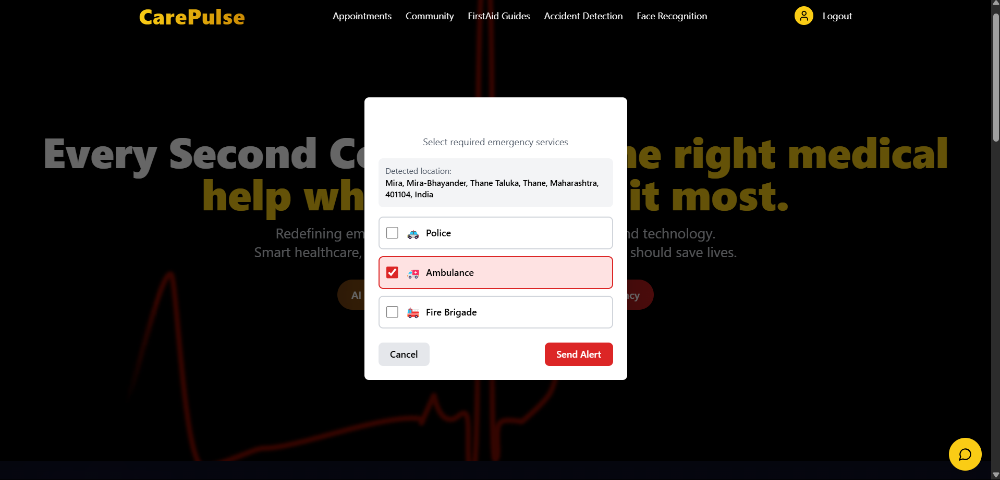
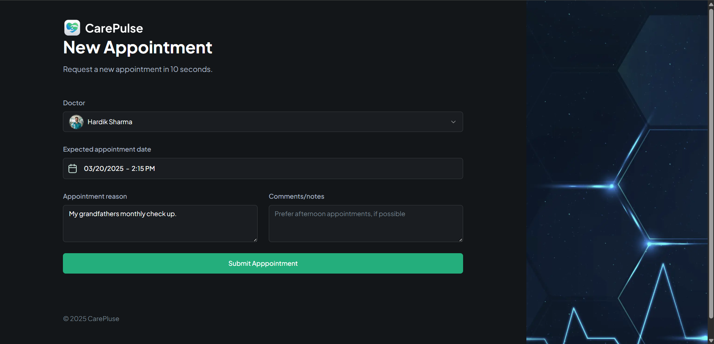
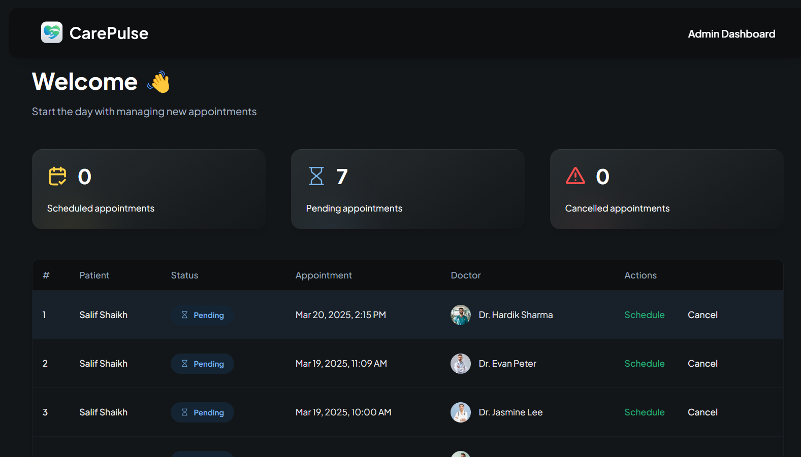
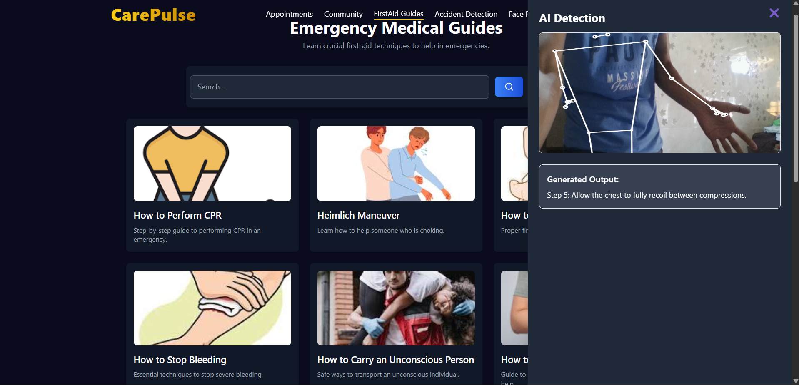
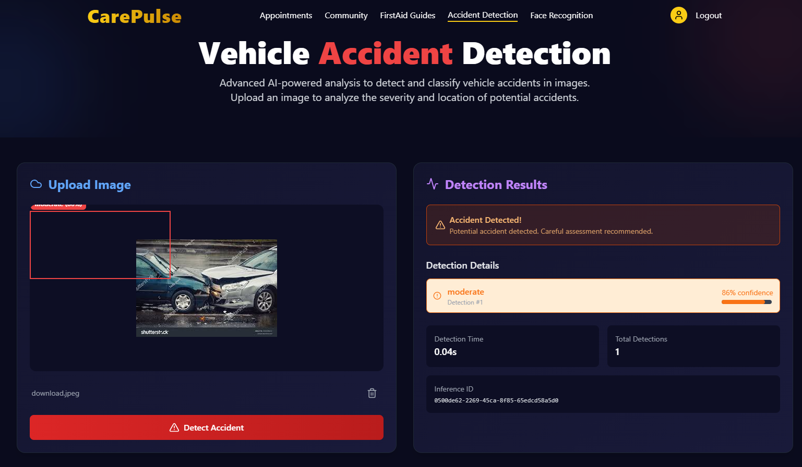
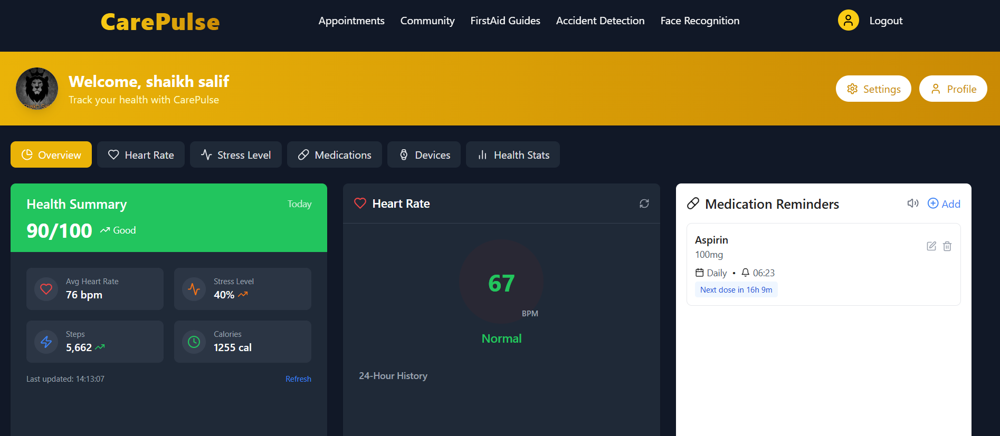

# CarePulse

CarePulse is an AI-powered healthcare platform designed to provide a seamless and intelligent healthcare experience. It integrates AI diagnosis, real-time health monitoring, emergency response systems, and community engagement tools to enhance patient care and safety.

## 🚀 Features

### 🏥 AI-Powered Healthcare
- **AI Diagnosis**: Smart AI model to provide preliminary medical diagnoses.
- **Doctor AI Bot**: Chatbot assistance for medical inquiries.
- **Appointment Booking**: Integrated doctor-side dashboard for scheduling and managing appointments.

### 🚑 Emergency & Health Tracking
- **Ambulance Tracker**: Real-time ambulance location tracking.
- **Emergency Contacts**: Quick access to emergency numbers and contacts.
- **Accident Detection**: AI-powered image recognition to detect accidents.

### 🏡 Personalized Dashboard
- **Smartwatch Integration**: Monitors health metrics via Google Fit API.
- **Personal Medication Reminder**: Custom reminders for medications and health routines.
- **Action Tracker**: Guides and tracks first aid procedures in emergencies.

### 🌐 Community & Resources
- **Community Page**: Connect with other users, share experiences, and seek advice.
- **First Aid Guides**: Educational resources to assist in emergencies.

## 📸 Screenshots

### Home Page and Dr. AI

### AI Diagnosis

### Ambulance Tracker

### Emergency Contacts

### Appointment Form and Doctor Dashboard

### First Aid Guides with tracker

### Accident Detection

### Smartwatch Integration and Personalised Reminder

## 🛠️ Tech Stack
- **Frontend**: React (Vite), Tailwind CSS, Framer Motion
- **Backend**: Firebase, Appwrite
- **Machine Learning**: AI Diagnosis & Image-Based Accident Detection
- **APIs**: Google Fit API, Gemini AI
- **Frameworks**: Next.js for appointment system

## 📌 Contributing
Contributions are welcome! Feel free to submit issues and pull requests.

